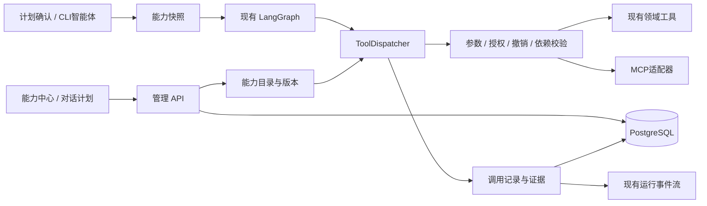

# 智能体能力中心设计：工具、MCP、SKILLS、记忆与知识库

日期：2026-10-08（北京时间）  
状态：设计规格，不能据此判定功能已完成；2026-10-09 复核和实施边界见[设计复核](2026-10-09-agent-capability-management-design-review.md)。  
适用范围：独立程序 `E:\AI\codex\redbook_agent`，运行数据位于 `E:\AI\codex\redbook_runtime`。  
配套文件：[界面、交互与验收设计](2026-10-08-agent-capability-management-ui-acceptance.md)。

## 1. 目标与边界

用户需要在图形化界面中看见并管理智能体的工具、MCP、SKILLS、记忆等能力，理解它能做什么、为什么本次使用某项能力、哪里失效，以及配置修改何时生效。

本设计按一个新的管理子系统处理。采用“统一能力目录和执行入口 + 分类管理页”，复用现有 LangGraph、领域工作流、模型配置、PostgreSQL 和任务监控。下文现状与实机数字是 2026-10-08 的核查快照；后续工作树中已有部分实现草案，尚不能代表完整执行链已接通。2026-10-09 本轮以设计为交付，不继续业务代码修改。

成功标准：

- 用户能在一分钟内找到一项工具，看到它的用途、实际状态、依赖、最近调用和出错原因。
- 开关由后端执行层落实，GUI、智能体及其 CLI 入口行为一致。
- 已发现、已允许使用、检测通过、本次被选择、实际已调用分别展示。
- 用户可以添加 MCP 连接、查看其工具、选择允许的工具，并在真实执行中追踪调用。
- 用户可以导入、预览、启停和选择 SKILL；能确认本次实际注入了哪个版本。
- 用户可以查看和修正长期偏好，搜索知识库，查看引用来源和上下文压缩记录。
- 管理页显示实际运行目录、Python 路径、浏览器 profile 和数据库命名空间。
- PostgreSQL/pgvector 继续作为生产记忆、RAG 和任务断点的持久化基础，不降级为 JSON、SQLite 或 Redis。
- 现有任务产物、平台草稿和历史文档保留；管理操作不隐式生成、上传、公开发布或批量删除稿件。

不在本期增加任意 Shell 控制台、任意 Python 在线编辑器、插件市场自动安装、通用多租户后台或新的智能体框架。已安装的开发用 Codex Skills/MCP 不会自动成为本软件的运行时能力。

## 2. 现状核查与明确缺口

### 2.1 核查依据

GitNexus 绑定仓库 `redbook_auto_agent`，索引时间 `2026-10-07T07:27:15.517Z`，索引提交与当前 HEAD 均为 `b7ba98c06ea5fb61cf0125e6f0a61a09c1960a81`。通过 query/context 核查能力、上下文及工具调用流程，再读实际文件确认动态回调及路由。此处没有把图中无调用者等同于功能不存在。

| 位置 | 当前已实现 | 管理缺口 |
| --- | --- | --- |
| `frontend/src/App.tsx` | 对话、草稿、运行记录、连接与模型、信源健康、图库 | 没有统一能力管理入口；确认计划时未提交技能选择 |
| `backend/app.py:PlanConfirm` | 接收 `skill_mode`、`skill_names`，默认 off | 前端未提供相应控件；独立 API 未暴露能力目录、压缩及知识库管理路由 |
| `tools/redbook_tools/apps/web_service.py:Workbench.agent_capabilities` | 汇总数据库、MCP 工具、技能目录和压缩可用性 | 每次查询会尝试启动 MCP；把探测和页面读取耦合；固定压缩供应商文案可能与真实模型绑定不同 |
| `src/agent/editorial_agent.py:EditorialAgentTools`（工具包内，下同） | 注入同步、生成、审核、上传、批量上传、读取产物等回调 | 业务工具缺少统一可管理描述、策略入口和调用流水 |
| `src/agent/mcp_manager.py` | 一个固定 stdio 服务；初始化、工具枚举、白名单、调用超时 | 未提供用户连接 CRUD；路径假设不符合独立部署；没有通用 HTTP 连接管理 |
| `src/agent/mcp_server.py` | `runtime_status`、`knowledge_search`、`news_search` | 只读工具存在不代表主采编链已实际通过 MCP 调用它们 |
| `src/agent/skills.py` | 目录发现、off/auto/manual、最多 3 项自动选择、资源读取、导入检查 | 缺少运行时目录 UI、版本/停用管理、导入预览、加载追踪；当前前置信息只支持受限格式 |
| `src/agent/conversation_store.py`、`compaction.py` | PG 消息、摘要版本、原始消息保留、摘要加近期消息、并发版本校验 | 缺少可视化；未证明已有长期偏好条目管理；不能把所有持久化消息称作都已送入模型 |
| `src/knowledge/store.py`、`service.py` | PG/pgvector 混合检索、用途过滤、增量索引、健康状态 | 缺少资料浏览、引用用途、排除、纠错和检索测试 UI；检索命名空间目前写定为 local |
| `src/agent/artifact_store.py`、`postgres_checkpoint.py` | PG 产物保留、运行租约、断点恢复 | 缺少与工具、技能、记忆版本的统一关联视图 |

还需明确一个上下文差异：现有 `compacted_context` 在没有摘要时只返回最近 16 条消息，而 `_agent_memory_for_execution` 在没有摘要时返回空对象。因此管理界面不能把“已持久化的历史”直接标成“采编生成已使用的记忆”；后续执行上下文适配必须与实际提示词注入一起验收。

### 2.2 2026-10-08 的只读实机结果

- `GET http://127.0.0.1:8786/api/health` 返回 HTTP 200，数据库 ready。
- 文档 4,390 条，已索引 4,372 条，空文本 18 条，`index_ready=true`。18 条空文本不能显示成 18 条索引失败。
- 嵌入模型为 `sentence-transformers/paraphrase-multilingual-MiniLM-L12-v2`，384 维。本期不更换模型。
- `MCPManager(E:\AI\codex\redbook_runtime)` 构造失败：`MCP_RUNTIME_MUST_USE_WORKSPACE_E_VENV`。它寻找运行区 `.venv`，实际 Python 在独立程序 `.venv` 下。这次没有启动 MCP 服务或执行其业务工具。
- `SkillCatalog(runtime).list()` 为 0 项，运行区 `skills/runtime` 和 `data/agent/skills` 均不存在。不能以开发环境有很多 Skills 推断本软件已经加载。
- 源码显示 MCP 调用入口及固定工具目录，但本次没有获得“采编主链已自动选用 MCP”的实机证据。
- 当前独立虚拟环境安装 MCP Python SDK 2.2.0；版本号是本地包元数据，不能单凭它判断本项目的适配代码已经兼容所有协议版本。
- 这些数字和状态是核查快照，未来界面必须读取实际数据，不能写死。

## 3. 方案选择

| 方案 | 结果 | 取舍 |
| --- | --- | --- |
| 只增加一个列表，读取现有模块和文件 | 能看见名称，但开关可能不影响执行，也解释不了实际使用情况 | 不采用 |
| **统一目录、策略、调用记录；分类管理** | 现有业务继续复用，页面配置与真实调用一致，可逐步增加连接和技能 | **采用** |
| 更换智能体框架并迁移所有工作流 | 需要重做任务恢复、平台交付和现有测试 | 超出本需求 |

控制面负责“有哪些能力、允许怎样使用”；执行层继续复用现有采编工具和平台上传锁。MCP 是工具的接入方式之一；SKILL 是可版本化的指导材料；记忆是有来源和作用域的持久信息，三者不能混为可执行插件。

## 4. 信息架构

左侧增加一个“能力中心”，位于“连接与模型”之后。内部六个页签：

1. 概览：可用性、待处理问题、近期调用、运行环境。
2. 工具：内置业务工具与 MCP 工具的统一目录、启停、参数、依赖、使用记录。
3. MCP：连接增删改、检测、工具发现、版本变化和进程状态。
4. SKILLS：目录、正文与资源预览、导入、版本、选择方式。
5. 记忆与知识库：长期偏好、资料库、对话上下文、任务断点。
6. 调用与变更：实际调用、诊断、配置修改，可跳回原任务。

已有“连接与模型”“信源健康”“运行记录”保留各自职责。能力中心用链接进入相应配置，不复制供应商密钥表单和信源编辑逻辑。

对话页右侧计划增加折叠区“本次能力”，包含工具、技能、记忆来源、实际模型和 profile 摘要。进入运行后该区域显示冻结的版本和实际调用结果。

## 5. 统一资源模型与状态

### 5.1 资源标识

使用稳定 ID，不用中文名称或磁盘路径作为主键：

- 内置工具：`builtin:news.generate`、`builtin:xhs.drafts.save_batch`。
- MCP 服务：不透明 `mcp_<id>`；工具：`mcp:<server_id>:<tool_name>`。
- 技能：`skill_<id>`，由独立的版本 hash 定位内容。
- 记忆：`memory_<id>`，另有作用域及 revision。

名称相同的 MCP 工具仍能通过 server_id 区分；技能显示名称冲突不能静默覆盖。清单中的主能力与子步骤分别计数，批量生成内部写稿、生图调用不得被当作新增独立工具重复统计。

### 5.2 工具描述契约

每项工具至少包含：`id`、名称、用途、来源种类、版本、输入/输出 schema、依赖、支持阶段、读写影响、是否消耗模型额度、并发组、幂等方式、超时策略、恢复方式、健康探针、证据链接能力。

状态分开保存和展示：

| 维度 | 值示例 | 含义 |
| --- | --- | --- |
| 配置 | enabled / disabled | 后续新任务是否允许选择 |
| 安装/发现 | registered / missing / invalid / discovered | 文件、连接或描述能否被解析 |
| 健康 | unknown / checking / ready / degraded / blocked / stale | 指定时间、指定探针得到的结果 |
| 使用范围 | unbound / manual / agent_preparation / workflow | 当前实际接到哪些执行入口 |
| 运行 | idle / queued / running / stop_requested / stopped | 本程序拥有的进程或调用状态 |
| 调用结果 | succeeded / failed / timed_out / denied / uncertain | 某次调用的事实状态 |

`enabled=true` 不推导出 ready；`tools/list` 成功只证明协议与目录可用；成功调用一次也不保证后续无限可用。所有健康状态带 `observed_at`、探针类型及配置版本。诊断结果不得复用到已经变更的连接配置。

### 5.3 配置生效规则

- 普通保存或停用：从下一次新计划执行开始生效，现有任务使用自己的能力快照。按钮附近标出“影响新任务；当前有 N 个任务仍使用旧版本”。
- “停止后续调用”：单独的立即撤销操作。已提交的外部请求先收集结果并保存证据；尚未开始的调用在统一入口被拒绝，任务保留断点。
- 运行期间修改路径、技能正文、MCP schema 或默认模型，不静默替换本次依赖。
- 恢复任务时检查旧版本是否仍可用及是否被撤销；有差异时展示变更，只对缺失或不兼容阶段重新准备，不整批重跑。
- 删除连接/技能先退役。已有任务引用的版本在引用释放前保留，界面显示使用它们的任务。

## 6. 工具管理与实际执行

### 6.1 首批内置目录

| 能力组 | 目录中可见的操作 | 执行约束 |
| --- | --- | --- |
| 账号与历史 | 同步已发布数据、读取账号分析 | 显示实际 profile、账号核验时间和产物快照 |
| 选题与材料 | 统一信源检索、AI厂商动态、福利检索、原文核验 | 复用信源服务、日期与来源规则 |
| 内容生产 | 每日新闻、AI讯息、每日我去、AI鸡蛋、全球关注图 | 栏目独立标识，复用各自工作流 |
| 图像 | 生图、参考图编辑、图片检查 | 模型选择归连接与模型页；费用策略不由工具开关覆盖 |
| 审稿与历史匹配 | 事实/文本检查、查重、图文检查 | 核验类必需依赖不能通过一个开关绕过 |
| 平台草稿 | 保存/更新草稿、读取草稿、批量保存 | 共享现有 profile 串行锁、交付凭据、读回规则 |
| 状态管理 | 查询进度、读取产物、恢复任务 | 复用 PG 断点与产物，不重新生成已完成稿件 |

这是拟登记范围，编码时逐项映射到真实适配器；没有执行适配器的条目显示“未接入”，不提供虚假的运行按钮。发布、删除等已有高影响操作以当前产品边界为准，能力中心不得绕过独立 API 的公开发布限制。

### 6.2 统一入口

`ToolDispatcher` 包装现有 `EditorialAgentTools` 回调，业务实现仍在原模块。内部细分到可开关的子能力时也必须经过同一策略检查，避免顶层停用了某工具、内部仍直接调用。防止递归包装造成双重执行或重复统计。

本期允许自定义的只读 MCP 工具在计划/材料准备/证据核验阶段被选择和调用。每项须登记输入 schema、允许阶段、输出用途和费用信息；写入平台的操作继续走已接入的业务适配器。新增服务仅完成发现时标为“待绑定”，用户选择使用范围后才进入对应阶段的可用工具集合。

主控只看到该阶段允许的工具及有界描述。选择后，后端校验真实 tool_id 和参数并调用；记录选择原因摘要、输入概要、结果引用。来源文本和技能正文不能自行增加工具权限。未知工具不通过“根据名称拼命令”执行。

### 6.3 检测与重试

“检查可用性”默认只做配置、依赖、协议握手、登录状态或只读操作，不启动一次新闻生成/上传。“试运行”对会消耗额度或改变本地状态的工具另行展示实际输入和影响。

- 只读调用可按工具策略有限重试；没有结果是有效业务结果，不等同于连接失败。
- 生成工具优先查询保留产物；同一 `operation_key` 命中既有成功产物时返回复用结果。
- 上传提交后状态不明标为 uncertain，先读回核对，不立即重复保存。
- 管理诊断采用独立队列，默认最多 2 个连接探测；浏览器写操作仍为同一 profile 同时 1 项。
- 工具可显示超时和并发，但允许修改的上限由适配器声明；不能把平台串行设成并行。
- 每次外部副作用前持久化调用意图；完成后持久化结果。数据库中断时保留本地原始证据用于恢复核对，不把它当作 PG 的替代记忆库。

## 7. MCP 管理

### 7.1 连接表单

字段：显示名称、传输方式、本地 executable/args/cwd 或 HTTP URL、显式环境变量/认证引用、启用状态、启动超时、调用超时、工具白名单、允许的调用阶段。

支持目标为 stdio 和 Streamable HTTP。旧式 SSE 不冒充 HTTP 支持；遇到该配置时返回“当前未接入的传输方式”。自定义 MCP 认证首期支持显式本地密钥引用，OAuth 如未实现则显示不支持，不提供可点但无后端的登录按钮。

截至本次核查，官方 latest 指向 2026-07-28 规范：标准传输仍包括 stdio 与 Streamable HTTP；新协议使用请求级元信息，旧版本则使用 initialize 握手。因此连接详情必须包含实际协议版本，适配层复用安装 SDK 的版本兼容能力，不能对所有服务无条件调用 initialize。检测分为“传输可达 → 协议识别/必要握手 → 工具目录 → 只读调用”。新旧版本都要有契约测试，未通过版本显示“不兼容”；不因一次失败无限切换协议。[官方传输规范](https://modelcontextprotocol.io/specification/2026-07-28/basic/transports)、[版本兼容规范](https://modelcontextprotocol.io/specification/2026-07-28/basic/versioning)。

导入 `mcpServers` 风格 JSON 时先做本项目支持字段的预览和校验。可识别的明文凭据转入本地凭据存储，未知字段和未支持认证列为问题；不执行导入文件中的命令来猜测配置。

### 7.2 修正独立部署路径

用显式 `RuntimePaths` 分开表示：

- application_root：`E:\AI\codex\redbook_agent`。
- tool_package_root：`application_root\tools\redbook_tools`。
- runtime_root：`E:\AI\codex\redbook_runtime`。
- python_executable：`application_root\.venv\Scripts\python.exe`，由启动配置解析并验证。
- MCP cwd：runtime_root；模块搜索路径：tool_package_root。
- 数据库凭据文件与模型缓存：runtime_root 内现有路径。

默认本地服务使用上述 Python 执行 `-m src.agent.mcp_server`。只传其必需的环境变量及明确凭据引用，避免复制整个主进程环境。代理变量按连接策略配置，界面区分“本地直连/继承指定代理”，不全局移除用户代理。

MCP 工具不会因初始化而复制浏览器 profile；需要平台工具时必须显式绑定现有 profile 引用。代码路径、数据路径分别显示，错误精确指向缺失项。

HTTP 连接只向明确配置的目标发送认证；拒绝携带认证跨 host 重定向，URL 中的凭据不进入日志。非本机地址默认要求 HTTPS；用户显式配置的本地服务可以使用 HTTP。新闻页面、MCP 工具结果或技能正文里的地址不自动创建新连接。

### 7.3 生命周期、发现与版本

- 打开页面只读取目录和最近一次检测结果。检测按钮才执行协议识别、必要初始化与 `tools/list`。
- stdio 按需启动；同一任务和相同配置版本可复用一个连接。无在途请求且空闲 60 秒或任务结束后关闭。
- 配置版本不兼容时建立新连接，旧连接只服务已有在途请求；只结束本程序持有的 PID/进程组。
- 新发现工具与已批准目录做差异：新增、移除、schema 改变。新增不自动启用，改变不静默沿用旧批准。
- 内置服务继续严格校验预期的三个工具；用户服务有独立的版本化工具集合，不能要求所有服务都只有这三个名字。
- `tools/list` 必须有界分页；没有读完时显示“目录不完整”，不能把未取到的后续页工具判作被删除。检测范围要与认证作用域对应，换凭据后重新比较目录。
- MCP 声明的只读/幂等注解是参考信息，不作为唯一授权依据。未知工具默认待确认使用范围；调用展示结合真实返回内容与错误标记。[官方工具规范](https://modelcontextprotocol.io/specification/2026-07-28/server/tools)。
- Resources/Prompts 可以显示是否支持和发现数量；首期不把它们自动拼进模型上下文，不承诺未接入的读取功能。

### 7.4 密钥与命令

复用当前模型平台的本地加密存储机制，通过 MCP 专用 secret 引用关联；不自动使用模型供应商密钥。界面只返回“已配置/缺失”，日志、导出、诊断下载都脱敏。

stdio 使用 executable + 参数数组，`shell=False`；cwd、可执行文件和安装输出必须符合 E 盘约束。管理页面不自动执行包安装、`npx -y` 下载或复制 C 盘技能。连接只是引用已安装程序；缺依赖提供明确路径与安装说明。

## 8. SKILLS 管理

### 8.1 目录与导入

目录分为“随应用提供”和“用户导入”。建议显式配置根目录：内置 `application_root/skills/runtime`，用户 `runtime_root/data/agent/skills`。当前均未配置的事实在迁移时保留为空态，不自动导入开发环境的全部技能。

导入流程：选择本地文件夹或 ZIP → 预览名称、描述、文件列表、来源、hash、格式问题 → 保存到 E 盘暂存 → 完整校验 → 原子激活一个不可变版本。

首期不自动联网安装 GitHub 仓库。手动从其他目录选择已有技能是复制内容，不修改原文件。拒绝路径穿越、符号链接/Windows 重解析点逃逸、超出限制的压缩包；不执行 scripts。ZIP 解压前校验累计解压大小和文件数，单文件上限也生效。

复用当前 SKILL.md 1 MiB、单个引用文本 256 KiB 的限制；目录总大小默认 20 MiB/500 文件。限制和实际拒绝原因在预览中显示。受限 frontmatter 解析不能识别的语法明确报错；扩展 YAML 支持须使用已审核的结构化解析器，不能静默忽略字段。

### 8.2 查看、启停与版本

列表展示：名称、简述、来源、版本、启用状态、适用栏目、最近加载时间。详情显示完整 SKILL.md、引用资源、版本差异和使用它的任务。

停用控制后续选择；版本升级创建新版本，运行中任务继续使用已冻结正文及资源 hash。普通用户编辑内置技能时创建个人副本。移除只退役索引和版本，不删除用户原文件或历史任务证据。

### 8.3 对话中的使用方式

- 关闭：不注入技能。
- 自动：依据栏目、标签、用户关键词选择至多 3 项；先列元信息，选中后加载正文，按需读资源。
- 手动：选择 1–3 项已启用技能。

保留当前 off 默认值，界面首次提供可见选择后由用户决定是否改默认。自动选择需要处理中英文栏目别名，不能把一整句中文当成唯一精确匹配词而持续选不出技能。

记录四个不同动作：候选、已选、正文已加载、引用资源已读取。不能声称“模型遵循了技能”或“阅读过所有附件”。附带脚本只有被登记为明确工具并授权时才可执行，单纯加载技能不授予命令执行权限。

## 9. 记忆、知识库与上下文

### 9.1 四种信息分别管理

| 分类 | 内容 | 允许的管理 |
| --- | --- | --- |
| 长期偏好 | 用户明确的写作、选题、配图习惯及作用域 | 新增、修正、停用、到期、查看来源和版本 |
| 资料库 | 已发布稿、草稿、统计、原始新闻、审核证据 | 搜索、原文/片段、用途、排除检索、补充纠错注释、增量索引 |
| 对话上下文 | 消息、压缩摘要、近期消息、有效约束 | 查看实际组成、覆盖范围、生成摘要、记录纠正、重新压缩 |
| 任务断点 | 任务阶段、已生成/已审核/已交付产物、冻结配置 | 查看和跳转现有恢复操作；不允许随意编辑 JSON 改成成功 |

### 9.2 长期偏好条目

新增 `MemoryService` 管理带来源的条目：内容、结构化键（可选）、workspace/account/column/conversation 作用域、origin、source_ref、active 状态、version、有效期、创建和更新时刻。

示例“新闻配图尽量不含文字”必须明确作用于本次任务还是长期新闻栏目，不能从单次修改自动推广为全局硬要求。人工直接新增立即生效于所选范围；模型推断先列为候选，用户接受后才成为长期偏好。

排序原则：程序执行权限和当前明确要求先满足；本次用户要求优先于历史偏好；更具体作用域优先于全局；同键冲突显示差异并采用最新明确修正。推断条目不覆盖用户确认条目。每次用于生成的记忆都有引用，用户能看见为何被采用或被覆盖。

偏好不是新闻证据；已发布稿可用于查重和风格，不能自动升格为事实来源。

### 9.3 知识库可见性与检索测试

资料列表支持按类型、日期、来源、用途、索引状态和命名空间筛选。详情展示原始记录、匹配片段位置、内容版本、来源 URL、发布时间、采集时间和历史版本。

“测试检索”输入关键词与用途，显示实际命中的片段、来源、排序方式和耗时。结果顺序来自现有语义/词法融合，分数不是新闻真实性百分比。显示模型、维度、索引版本；无向量或数据库不可用返回真实错误。

索引进度分别显示非空已索引、非空待索引、空文本跳过、失败；健康判定复用现有规则。“增量索引”是单独后台任务，不在打开页面时自动扫描或调用模型。

现有 `KnowledgeStore.search` 使用写定的 local namespace，新增界面不能只加账号下拉框。检索、入库、索引任务和 API 必须贯通显式 namespace。历史 local 数据先保留“历史未绑定”标签；用户确认映射后才迁移，不根据浏览器路径猜测所有历史数据归属。

### 9.4 纠错、排除与遗忘

- 新闻原始证据保持原文；纠错作为有来源的附加注释和版本，不改写外部原始报道。
- “排除检索”在 PG 写入策略并立即进入所有检索过滤，不能只从前端列表隐藏。
- 排除事实引用可保留 duplicate_reference 用途，防止忘掉历史发过的文章后再次发布；UI 让用户选择排除的用途。
- 停用长期偏好保留版本和操作记录；明确“忘记此偏好”需同时使派生摘要和缓存中的该偏好失效，后续上下文组装不能重新注入。
- 历史压缩摘要有来源关联，受影响摘要标记 invalidated，使用有效原消息范围重新构造或重新压缩，不能重复播放旧摘要。
- 运行中的模型请求已收到的内容不能撤回；更改从后续尚未提交的上下文构造生效，并记录版本变化。
- 本期不提供“清空整个数据库”或顺带删除本地图片/平台稿件的按钮。

为完成上述失效处理，新摘要需记录 memory_id/version、消息范围与上下文策略版本。旧摘要缺少精确来源关联时保守标记需重建，不声称能精准从旧字符串中删除某条偏好；重新总结时仍须应用已停用/遗忘的偏好过滤规则。

### 9.5 压缩可视化

展示实际主控模型、摘要版本、覆盖到的消息序号、保留的近期消息、约束来源、上下文估算 token、是否需要压缩、压缩失败原因和历史摘要。

当前压缩策略默认软阈值 12,000、保留最近 16 条消息、摘要调用最多两次。这些是当前实现参数，不是任务运行时长预算。页面明确 token 为估算值，不标成供应商账单用量。

摘要压缩率须比较同一范围：压缩前完整有效上下文，对比压缩后摘要加未压缩后缀及固定提示。现有 input_tokens/output_tokens 若范围不同，不能直接相除显示“节省 X%”。实际计费 token 仅在供应商确实返回时单列。

摘要无收益返回“无需替换”；并发新消息导致 revision 改变返回冲突，保留旧摘要。重置/纠正摘要不删除原消息。界面要指出当前真正用于下一次模型调用的范围，避免“数据库存了全部历史”等同于“模型看到了全部历史”。

新增可见的上下文策略：自动压缩/仅手动、软阈值、近期消息保留量，默认沿用当前参数和实际启用状态，不把不存在的自动触发描述成已开启。无有效摘要时应从允许使用的原消息构造上下文；超过输入上限则先进行有记录的压缩，不能静默只保留最后 16 条并宣称保留了完整记忆。压缩失败时显示受影响的下一次模型调用，保留已完成产物。对执行适配器增加实际注入记录，证明偏好、摘要和必要消息确实到达写稿/规划阶段，而不仅存在于计划 JSON。

## 10. 存储、API 与模块设计

### 10.1 PostgreSQL 数据边界

以下为拟新增逻辑表，不在本次执行 DDL：

| 表 | 内容 |
| --- | --- |
| `agent.capability_settings` | 内置工具策略、启用状态、scope、revision；不复制业务源码 |
| `agent.resource_versions` | 工具策略、MCP连接、上下文策略的不可变配置版本及hash；运行引用具体版本 |
| `agent.mcp_connections` | 连接配置、secret_ref、批准工具 schema、配置版本与退役状态 |
| `agent.skill_versions` | 文件路径、内容/资源 hash、来源、当前启用版本、加载策略 |
| `agent.memory_items`、`agent.memory_versions` | 可管理长期偏好及不可变历史版本 |
| `knowledge.document_policies` | 命名空间+record_id 对应的检索用途排除、纠错引用、revision |
| `agent.capability_snapshots` | 本次计划/运行的工具、配置、技能及记忆版本引用 |
| `agent.capability_calls` | 结构化调用流水、parent_call_id、operation_key、状态、耗时、结果引用 |
| `agent.resource_changes` | 操作者、资源、版本变更、脱敏差异、来源任务 |

复用现有 conversations/messages/compaction_snapshots/task_artifacts 和 PG checkpoint，不建立第二套对话历史。健康结果可作为带探针标记的调用记录和最近状态投影；不另造全局调度系统。

对调用流水按 workspace/run/resource/time 建索引；对 operation_key 设置与动作语义匹配的唯一约束。修改使用 expected_revision/If-Match，冲突返回 409。小事务内完成配置和变更记录；数据库事务不包住网络调用或整个新闻生成任务。

运行快照引用不可变资源版本，不能仅保存指向“当前配置”的资源 ID。密钥轮换也采用新 secret_ref；旧引用被显式撤销后，恢复任务须展示需要重新绑定的差异。数据库版本表只保存引用，不保存可用明文密钥。

文件位置：用户技能 `runtime/data/agent/skills`；能力日志与大结果 `runtime/data/agent/capabilities`；临时导入与 MCP stderr `runtime/data/tmp`；秘密仍存本地凭据目录。数据库保存引用与摘要，图片和大型 HTML 不塞进调用表。

所有本地运行数据、技能私有正文、凭据、日志与数据库文件均不提交 Git。文档和不含密钥的预置清单可提交。保持独立智能体与旧工作流的代码/数据边界，不通过运行时回指旧工作流目录取得必需文件。

### 10.2 拟新增模块

| 模块 | 职责 |
| --- | --- |
| `src/agent/capabilities/models.py`、`registry.py` | 统一描述、状态、内置适配器映射 |
| `src/agent/capabilities/policy.py`、`dispatcher.py` | 生效规则、阶段权限、参数、调用记录和撤销 |
| `src/agent/capabilities/store.py` | PG 配置、快照、调用、变更 |
| `src/agent/capabilities/runtime_paths.py` | application/tool/runtime/python 路径解析 |
| 现有 `mcp_manager.py` + 有限传输适配器 | 连接配置、生命周期、探测和实际调用 |
| 现有 `skills.py` + 版本/导入服务 | 保留加载语义，补目录、版本、导入与选用审计 |
| `src/agent/memory_service.py` | 长期偏好、作用域、纠错和使用引用 |
| 现有 knowledge 与 compaction 服务 | 检索排除、显式 namespace、进度、上下文状态 |
| `backend/capabilities.py`、`backend/memory.py` | FastAPI 管理路由与版本校验 |
| `frontend/src/capabilities/` | 页签、列表、详情抽屉、检测与导入交互 |

这里的 src 均在独立程序随附工具包内。旧脚本可继续调用现有领域函数；智能体 GUI/CLI 的管理策略在共享智能体适配层统一执行。旧工作流若以后增加同类管理页面，再显式移植，不在此次设计中要求同步改其数据库。

### 10.3 API 契约

所有新增路由复用现有本地会话、同源检查及 `x-workbench` 写请求头。GET 不启动外部工具、浏览器或模型。

| 方法/路由 | 返回或行为 |
| --- | --- |
| `GET /api/capabilities` | 描述、配置、最近健康及版本；局部失败不掩盖其他资源 |
| `GET /api/capabilities/{id}` | 详情、依赖、允许参数、当前引用任务 |
| `PATCH /api/capabilities/{id}` | 更新允许修改的策略，返回生效范围与新 revision |
| `POST /api/capabilities/checks` | 幂等提交异步检测，返回 operation_id，不进行业务试跑 |
| `GET /api/capabilities/checks/{id}` | 检测进度、探针证据、可操作错误 |
| `POST /api/capabilities/{id}/revoke` | 停止后续调用，返回受影响任务 |
| `GET/POST /api/mcp/connections` | 列出/新增连接 |
| `PATCH/DELETE /api/mcp/connections/{id}` | 修改/退役；有活动引用时保留所需版本 |
| `POST /api/mcp/connections/{id}/discover` | 异步握手、枚举、目录差异，不自动授权新工具 |
| `POST /api/mcp/connections/{id}/tool-policy` | 采用特定 schema 版本及允许阶段 |
| `GET /api/skills`、`GET /api/skills/{id}` | 目录与完整版本信息 |
| `POST /api/skills/import-preview`、`POST /api/skills/import-commit` | 先校验后原子保存，提交绑定 preview hash |
| `PATCH/DELETE /api/skills/{id}` | 默认策略/版本选择/退役 |
| `GET/POST /api/memory/items`、`PATCH /api/memory/items/{id}` | 长期偏好的搜索、新增、修正、停用 |
| `POST /api/memory/items/{id}/forget` | 停用并作派生上下文失效处理，返回处理进度 |
| `GET /api/knowledge/documents`、`GET /api/knowledge/documents/{id}` | 元信息、原文、片段、索引与用途 |
| `POST /api/knowledge/search` | 指定 namespace/purpose 的检索测试 |
| `PATCH /api/knowledge/documents/{id}/policy` | 用途排除及注释引用 |
| `POST /api/knowledge/index-jobs` | 提交增量索引，返回可追踪任务 |
| `GET /api/conversations/{id}/context` | 实际上下文组成、摘要范围与版本 |
| `POST /api/conversations/{id}/compact` | 明确提交压缩任务，使用当前主控角色 |
| `PUT /api/conversations/{id}/context-policy` | 保存自动/手动压缩与有界参数；返回生效范围及revision |
| `PUT /api/conversations/{id}/plans/{plan_id}/capabilities` | 保存本次选择及策略版本，未执行计划可改 |
| `GET /api/runs/{id}/capabilities` | 冻结版本、实际使用记录、恢复差异 |
| `GET /api/capability-calls`、`GET /api/resource-changes` | 游标分页、筛选、关联原任务 |

复用运行查询与事件通道跟踪长任务。列表默认 50、最大 200 项；不要一次返回所有技能正文、原始文档或向量。

统一错误字段：`code`、可读 message、resource_id、retryable、next_action、observed_at、revision；按原因使用 409/422/503，禁止把秘钥或原始进程环境塞进 message。

## 11. 一致性、性能与恢复

- 计划确认时冻结工具配置和内容版本；已运行计划的能力配置不可覆盖。既有计划版本号和幂等机制继续使用。
- 可选 MCP 失败，只影响绑定它的可选准备动作；不可用不能导致整个目录和对话页白屏。任务确实依赖它且无已授权等效工具时，显示具体阻塞原因并保留产物。
- PostgreSQL 不可用时保留静态目录和标有时间的最近状态预览；配置写入及依赖 PG 的执行返回不可用，不创建替代生产数据库。
- 管理页读取不得调用 `MCPManager.list_tools` 作为每次刷新步骤。健康短期缓存按配置版本命中；后台探测与真正业务任务隔离。
- 页签按需取数；有在途诊断时订阅事件或短轮询，隐藏页面停止轮询。不要新增每秒完整知识库统计。
- 计时区分排队、连接建立、实际调用、重试和总墙钟时间；并行子步骤不能直接相加当总耗时。成功率须同时显示样本量和时间范围，无数据标“未采集”。
- MCP 工具输出只给模型有界摘要和证据引用，完整结果按需读取。技能正文和记忆按任务相关性加载。
- 检测缓存默认 60 秒；超过有效期显示上次结果时间。真正调用仍按依赖和撤销策略校验，缓存不是执行授权。
- 未来验收目标：暖启动且本地 PG 可用时，50 项目录 GET 的 p95 不超过 500 ms；大型资料页分页；这是验收目标，不是本次实测承诺。

## 12. 实施顺序与完成定义

1. **路径与目录真实性**：分离运行路径，建立描述清单和读取 API；把现有 MCP 失败、技能空目录显示出来。
2. **真实策略与调用记录**：统一智能体 GUI/CLI 调用入口，补配置版本、启停、快照、实际调用证据。开关不可仅前端生效。
3. **MCP 与 SKILLS 管理**：连接 CRUD/检测/工具绑定、技能导入/版本/本次选择，完成实际调用链。
4. **记忆与知识库管理**：长期偏好、资料检索与用途排除、摘要与断点可见性。
5. **对话联动和恢复验证**：本次能力、逐步调用记录、配置变化后的断点续跑、完整回归。

完成定义：五步全部通过配套验收，才称“能力中心可管理”。仅增加静态目录或按钮不作为完成。

编码前必须重新对 `execute_agent_plan`、`EditorialAgentTools`、`MCPManager`、`SkillCatalog`、`KnowledgeStore.search`、上下文组装和共享上传入口做 GitNexus impact。遇到 HIGH/CRITICAL 先报告范围；UNKNOWN 继续用实际调用/测试补证。涉及提交时完整执行 detect_changes。

本次设计核查只验证了现有路径、目录及健康 API，没有进行新功能测试、上传或生成任务；Pencil 当前未返回可访问的打开画布，页面布局以配套文档的线框和具体交互为准。
