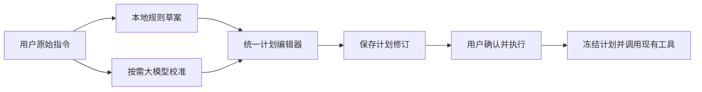

# 可编辑任务计划与大模型校准设计

日期：2026-10-09（北京时间）。

状态：设计基线完成。本次仅补充设计与验收规范，不修改产品代码，不启动模型请求、内容生成或平台操作。工作树中已有实现改动不等于本设计已通过验收，实施结果须另行报告。

适用项目：`E:/AI/codex/redbook_agent`，包含随项目分发的 `tools/redbook_tools`。配套：[实施与验收计划](2026-10-09-editable-task-plan-implementation-test-plan.md)。

## 1. 用户目标与决策

用户输入自然语言后，先快速获得本地规则草案；需要时主动点击“大模型校准”。用户可编辑规则草案和模型候选的任务属性、增删选题偏向，最后确认实际执行的版本。

本设计采用以下流程：



核心决策：

1. 本地解析、大模型理解都产生候选，不拥有最终的任务意图裁决权。
2. 大模型按原始指令和用户已保存的修改理解任务；本地正则结果用于差异展示，不作为模型输出必须一致的答案。
3. 任务数量、主题、措辞等理解差异显示给用户，通常不阻断候选展示。
4. 用户可以修改或删除原始指令中的业务要求。保存的修改成为新要求，保留原文用于追踪，不拿原文再次否决用户修改。
5. 参数是否合法、操作是否受支持、模型是否可用等检查继续由程序负责。
6. 编辑、保存、采用、校准均不执行任务。原有“确认并执行”仍是执行入口。

验收的关键结果：用户把“10条”改为“5条”、删除“隐私与年龄核验”、增加“游戏退款”，最终工具收到的任务就是5条，并使用编辑后的选题要求。

### 1.1 三种判断各自负责什么

本地规则负责快速提出草案；大模型负责理解原始指令并提出独立建议；用户负责选择和修改最终任务。程序只检查结构、参数范围、实际工具能力、权限、版本和计费边界，不再判断“大模型是否与正则答案相同”。

原始指令保留在可展开的对照区，不能被规则归纳结果替换。用户已保存的修改优先于原文；原文也不能再次否决用户主动新增、删除或改写的偏向。引用编号是说明的出处定位，不是业务语义的正确性证明。

用户对候选的操作只有三类：保留当前值、采用模型建议、直接输入自己的值。理解差异由这些操作解决，不新增另一个模型进行循环裁决，不要求用户修复内部引用编号。

### 1.2 本次确认的校验边界

“不再由正则判断模型结果”指取消规则草案对任务语义的否决权，不是移除所有程序校验：

| 判断对象 | 依据 | 结果与决定者 |
| --- | --- | --- |
| 本地规则草案是否符合用户意图 | 可展开的原始指令 | 用户直接编辑，不必先调用模型 |
| 模型理解是否符合用户意图 | 原始指令、已保存的人工修改、当前候选 | 用户选择、修改并确认；程序不宣称语义已验证 |
| 当前计划与模型候选有何变化 | 两份结构化字段 | 程序生成对比，不将当前计划当作正确答案 |
| 引用能否定位到原始指令 | 服务端原文片段编号 | 只能证明出处可定位；编号错误不隐藏核心候选 |
| 数据是否可读取、字段是否受支持 | Schema、范围、能力与模型目录 | 程序校验，问题定位到字段；无法修复的根结构损坏才没有可用候选 |
| 是否可以启动执行 | 已保存修订、用户确认、权限、版本与计费策略 | 服务端决定技术可执行性，不重新用规则提取值覆盖最终计划 |

正则仍可用于有限格式检查、敏感信息脱敏和本地快速识别；不得据此要求模型的主题、数量、栏目或措辞与规则结果完全一致。来源定位也不能替代语义判断。

用户可编辑所有已接入实际消费者的业务属性；没有执行能力的属性必须显式说明，不提供看似保存成功但实际被忽略的控件。宿主权限、任意命令、密钥、浏览器目录和计费限制不是可编辑任务属性。

### 1.3 最终决策顺序

本次确认的设计按以下顺序实现，不能以“正则和模型谁更准确”替代用户选择：

1. 本地规则先生成可编辑草案；用户可以不调用模型，直接调整属性。
2. 用户主动校准时，大模型读取原始指令、已保存的人工修改及可用能力。规则草案只在服务端参与对比，不作为模型必须复现的答案。
3. 核心候选能解析就展示。漏掉关键词、改写偏向、篇数不同、引用编号错误分别显示差异或待核对说明，不自动否决或修成规则值。
4. 用户对照原始指令选择保留、采用或自行修改。原始指令是判断依据，不是禁止用户修改任务的不可变约束；已保存的新要求优先。
5. 保存修订后，侧栏展示实际将执行的栏目、篇数、检索词、选题偏向、交付方式和模型。保存不启动生成或上传。
6. 用户确认后，服务端检查必要的参数、能力、权限和版本，并冻结最终修订。不能重新用正则、旧prompt或历史记忆覆盖它。

例如，最初要求10篇，模型建议8篇，用户最终改为5篇：三个值均保留在各自的来源和修改记录中，执行篇数只有5。用户删除“隐私与年龄核验”、新增原文没有的“游戏退款”后，执行参数使用新偏向，不要求新词出现在最初指令中。

理解计划正确与新闻内容真实是两项独立责任：用户确认前者，后者仍由采集、日期核验、查重和内容审核流程检查。计划确认不能跳过新闻质量门禁。

## 2. 改造前的问题依据

以下表格描述改造前的设计基线，而非断言当前工作树仍保留所有旧行为。已核对提交 `b7ba98c`：旧 `validate_candidate` 确实按正则数量和 `extract_job_topics` 的关键词集合拒绝候选，引用校验也会抛出异常。本次同时读取了当前 `redbook_auto_agent` 索引中的实现上下文，确认工作树已有后续改动；不能把旧提交的缺陷直接当作当前实现的测试结论。当前实现是否符合本设计，须在实施验收报告中单独验证。

| 位置 | 基线行为 | 改造原因 |
| --- | --- | --- |
| `backend/task_recognition.py::validate_candidate` | 从原文重新用正则抽取数量、检索词，再决定是否拒绝模型候选 | 本地规则也会误读，不能承担最终语义裁决 |
| `resolve_evidence_quote` | 要求引用编号和附带文字精确一致，失败抛出异常 | 内部引用标注错误会隐藏整个候选，用户没有修正入口 |
| `RecognitionService._run` | 任一上述异常使 `candidate` 为空，状态为 `failed` | 需要区分计划本身无效与附加说明待核对 |
| `frontend/src/TaskCalibration.tsx::PlanJobs` | 数量、关键词、选题要求都是只读展示 | 无法直接调整选题偏向 |
| `frontend/src/PlanModels.tsx`、`backend/app.py::plan_models` | 已有模型角色编辑、版本比较、已执行计划冻结 | 复用交互和并发语义，统一到计划修订服务 |
| `src/agent/task_intent.py::extract_job_topics` | 规则结果包含 `keywords/keyword_mode/topic_brief` | 继续用于快速草案，退出模型候选的语义硬校验 |
| `Workbench.execute_agent_plan` | 写入任务文件后启动现有任务 | 冻结文件必须来自最终保存的修订 |
| `apps/cli.py::_load_agent_job_plan` | 主要读取 `kind/count/prompt/evaluation_viewpoint/lookback_days` | 界面属性必须编译为实际工具输入，不能只保存展示字段 |
| `PostgresConversationStore.save` | PostgreSQL 会话 payload 加 `_revision` 乐观锁 | 可保存修订和审计，无需更换数据库或引入 Redis |

截图中的“要求 r7 的编号与附带原文不一致”属于引用标注错误。它说明编号映射与附带文字不一致，不能据此证明模型误解了任务，更不能说明新闻生成失败。

本设计取代以下旧约定：

- [10月3日任务识别设计](2026-10-03-agent-llm-task-recognition-design.md)中“语义差异一律不可采用”和“只能整体采用或放弃”的部分。
- [10月6日关键词校准方案](2026-10-06-news-keywords-task-calibration.md)中强制对齐本地抽取结果的部分。
- [10月7日引用修复](2026-10-07-task-keyword-evidence-fix.md)中引用格式错误使整个候选失败的部分。

旧文档作为历史记录保留。它们的同源鉴权、一次调用、禁止自动付费切换、PostgreSQL 存储和执行冻结约束继续适用。

## 3. 方案比较

| 方案 | 效果与成本 | 结论 |
| --- | --- | --- |
| 继续扩充正则和引用容错 | 改动小，但模型理解仍受规则限制，用户仍不能编辑 | 不采用 |
| 完全接受模型结果并立即执行 | 操作少，但理解错误会直接传入生成和上传 | 不采用 |
| 统一可编辑计划，差异提示，用户确认，程序校验实际能力 | 需要计划修订接口和编辑界面，可复用现有执行器 | 采用 |

改造范围是任务识别与执行前确认，不新增聊天框架，也不重写新闻采集、生成或上传工具。

## 4. 任务意图、能力和证据的职责

### 4.1 最终执行参数的来源

最终已保存、已确认的计划是执行参数的唯一依据。原始消息、规则草案、模型候选都保留，但不在执行时再次覆盖该计划。

校准输入优先级：

1. 用户最近保存的字段修改，包括清空数组、清空说明和删除栏目。
2. 本次任务的原始用户指令。
3. 公开展示的宿主默认值，仅填充尚未指定的字段。

大模型建议产生新的候选，用户可以采用、编辑或保留当前值。再次校准默认保留人工修改；若模型建议改变人工字段，界面展示差异，只有用户明确选用该项后才修改。

清空值不能用 `value or old_value` 合并回旧值。未提供字段表示继承，显式空值表示用户清空，二者必须区分。

采用请求用 `accepted_candidate_paths` 明确用户选用的候选字段，字段路径按稳定栏目ID定位。未列出的人工字段保留原值；显式接受的新值写入新的 `manual_overrides`。恢复历史版本也按“当前版本到恢复目标”的字段差异重建覆盖记录，不能复用旧版本的覆盖字典。删除栏目保存删除记录，重新添加同类栏目生成新ID；后续校准不会复活原ID。

与人工覆盖冲突的替代值使用结构化 `field_suggestions`，不藏在自由文本澄清中。模型仅提供有限的栏目类型、字段名、建议值和理由；服务端校验类型并映射为稳定 `field_path`，记录基础值摘要。界面展示当前值与建议值，默认保留人工值。用户勾选该字段后，`accepted_candidate_paths` 才采用对应建议；用户在编辑器直接输入第三个值时，明确的 `editable_fields` 优先于该建议。采用同时检查候选基础版本和建议基础值摘要，不以过期建议覆盖新编辑。

### 4.2 检查分级

| 情况 | 是否展示候选 | 处理 |
| --- | --- | --- |
| 数量、栏目、主题与规则结果不同 | 是 | 展示新增、移除、修改差异，用户决定 |
| 模型归纳、拆分或增加检索表达 | 是 | 显示为模型建议，不能标成用户逐字指定 |
| 引用编号不存在、附带文字不一致 | 是，前提是核心计划可解析 | 对该说明标记“来源标注待核对”，不伪造已核验引用 |
| 模型主动提出待澄清问题 | 是 | 展示相关字段，允许用户直接填写或编辑 |
| 新闻数量为0、超过20，栏目重复，模型引用不存在 | 是，可定位字段时 | 字段错误，允许编辑，修正前不能执行 |
| JSON整体损坏、截断、重复键或根结构无法解析 | 无可靠候选 | 原计划保留，可直接编辑原计划或主动重试 |
| 请求程序不支持的操作或约束 | 是 | 展示能力错误及对应字段，修改后再执行 |
| 计划已执行、版本过期、跨会话引用、鉴权失败 | 不采用提交结果 | 返回冲突或权限错误，保留用户未保存的编辑 |
| PostgreSQL不可用 | 保留界面编辑内容 | 不显示保存成功，不启动未保存计划 |

原文明确“不上传”而模型提出“存草稿”时，显示醒目的交付差异；校准不直接更改当前交付方式。用户在候选中选择并保存交付方式，再点击展示该交付方式的“确认并执行”，形成明确的新指令。模型自身无权替用户扩大操作范围。

数量和主题的语义差异不用 `TASK_LLM_INVALID_OUTPUT` 处理；该错误仅用于无法可靠解析模型输出等实际格式故障。

### 4.3 保留的执行约束

- 每日新闻1至20篇；其余现有栏目各1篇，集合稿内部条目数不是稿件数。
- 交付仍为“仅生成本地稿”或“保存平台草稿”；本次不增加公开发布、删除等能力。
- 模型来自现有本地目录，角色能力和计费策略须可用；不自动切换付费 API。
- 查重、来源和日期核验仍由现有工作流执行；编辑计划不构成事实核验。
- 专用 profile、后台运行策略按宿主配置执行；编辑器不接受任意命令、密钥或浏览器目录。
- 当前不能保证分类硬配额。明确要求“必须2条”时保留原意，用户可改为偏好或删除，不能自动把“必须”降成“尽量”。

自由文本的要求强度由用户在同一编辑表单中选择“选题偏好”或“必须满足”，不由正则替用户裁决。人工新增或实质修改非空补充要求时，强度选择绑定该文本摘要；未选择可保存为 `needs_input`，不能把它默认承诺为硬约束。校准可建议强度，用户仍可修改。

“必须满足”要求需要绑定有限的执行能力：例如篇数转到实际 `count` 字段；分类最少篇数转为结构化 `topic_min_count`，当前能力清单明确不支持；其他无法映射的自由文本硬要求为 `unbound`。后两者产生字段问题，用户可改为偏好、修改为支持的参数或删除。不通过再调用一个模型或继续堆叠正则来判定任意自由文本都可保证执行。

## 5. 前端设计

### 5.1 入口与布局

保留右侧“本次计划”，标题下增加带 `Pencil` 图标的“编辑计划”，与“大模型校准”并列。保留当前配色、字号和边框；不改造其他页面。

```text
本次计划                                      待确认
来源：大模型校准 · 已人工修改
[编辑计划]                         [大模型校准]

每日新闻                         5篇
选题偏向  知名平台禁令与解禁 / 游戏退款
检索词    无额外限制
选题说明  约3篇偏向有意外转折的权益事件

交付：小红书草稿箱    运行模式：速度优先
本次模型：主控 / 写稿 / 生图
修改记录：10篇改为5篇，移除1项偏向，新增1项偏向

[确认并执行]
```

“编辑计划”打开右侧抽屉；桌面宽度560px、最大宽度为视口宽度，窄屏为全屏面板。表单分组用标题和分隔线，不在抽屉里嵌套卡片。固定底部操作栏，正文独立滚动。

```text
编辑本次计划                                  [关闭]

栏目       每日新闻                          [移除]
篇数       [-] 5 [+]

选题偏向   知名平台禁令与解禁 [×]
           游戏退款 [×]
           [输入偏向]                         [＋]
检索词     [输入检索词]                       [＋]
补充要求   [多行文本框]
要求强度   [选题偏好 | 必须满足]
评价视角   [现有选项 / 自定义]

[＋ 添加栏目]

运行模式   [速度优先 | 平衡]
交付方式   [本地稿 | 平台草稿]
平台       [小红书 ▾]
图片评分   [开关]
本次模型   [沿用现有三个角色选择器]

本次变化   10 → 5篇；移除隐私与年龄核验；新增游戏退款
                         [取消] [保存计划]
```

候选比较区提供“编辑候选”“采用候选”“保留当前计划”。编辑候选与编辑当前计划使用同一组件。候选的主按钮在修改后变为“保存并采用”，只保存计划，不运行任务。

### 5.2 可编辑属性

| 属性 | 控件 | 保存与执行含义 |
| --- | --- | --- |
| 栏目 | 添加菜单、移除图标 | 只列出当前支持的栏目，最多各一个 |
| 新闻篇数 | 数字输入及步进按钮 | 1至20；其他栏目显示固定1篇 |
| 选题偏向 | 可编辑、可删除标签及输入框 | 软性排序偏好，可以全部清空 |
| 检索词 | 独立的标签输入 | 指定检索主题，与软偏好分开；不宣称保证每篇同时包含所有词 |
| 补充要求 | 多行文本框 | 比例、叙事要求、来源或读者偏好；完整保留句子 |
| 要求强度 | 分段选择 | 非空补充要求绑定偏好/必须；未能绑定实际执行字段的硬要求待修正 |
| 评价视角 | 现有选项及自定义输入 | 写入栏目 `evaluation_viewpoint` |
| 运行模式 | 分段选择 | 速度优先或平衡，覆盖本次任务 |
| 交付方式 | 分段选择 | 本地生成或平台草稿 |
| 平台 | 现有平台菜单 | 仅限已实现平台；不可用项显示原因 |
| 主控、写稿、生图模型 | 复用角色选择器 | 不修改全局默认绑定 |
| 图片评分硬门槛 | 开关 | 复用已有可选机制 |

日期窗口在本期作为只读策略显示：新闻沿用当前运行策略，AI讯息沿用其新鲜度门禁。后续只有存在明确执行消费者的日期选项才可开放；不提供“关闭日期核验”。额度同步保持宿主现有策略，不在本次任务编辑器中新建入口。

字段可编辑性按栏目能力决定。当前CLI把选题prompt和评价视角传入每日新闻、每日AI讯息、每日我去；AI鸡蛋和全球事件关注图的生成调用尚未消费这些字段。因此本期对后两类隐藏这些不生效的编辑项；旧计划带有此类要求时给出能力问题，不能保存后声称已执行。新增这些下游能力另行实施，不能仅增加GUI输入框。

隐藏仅指不提供新增此类值的输入框。旧计划或模型候选已经带有不支持的值时，在对应栏目下显示“待处理要求”：完整只读展示原值、说明不支持的原因，提供逐项“移除此要求”操作。清除写入显式空值后重新校验；不能自动清除、隐藏后丢失，或让用户必须删除整个栏目才能修正。

### 5.3 编辑与差异显示

- 主题标签只是展示，不重复把同一串主题再写进补充说明。补充说明保存用户确实需要的额外要求。
- 用户删除标签时，不对自由文本做盲目字符串替换。新计划的补充要求不由标签重复派生；旧计划含重复描述时，显示可编辑的旧说明和冲突提示。可保存为 `needs_input`，用户明确选择保留该说明或修改冲突内容后才可执行。
- 数量、主题与原文不同允许保存，标明“已人工修改”。改变发生在哪个字段，应能直接定位。
- 未保存的本地编辑期间禁用确认执行，避免页面显示新值却运行旧值。保存成功后才恢复执行按钮。
- 模型请求中允许打开编辑器和保存修改；返回的旧版本候选标为过期，不能覆盖已保存修改。
- 模型候选只影响编辑/对比区，自动返回不等于自动采用。用户保留当前计划后，正常恢复执行入口。
- 可查看原始指令和版本差异；历史版本恢复是创建新修订，不抹去之后的历史。
- 关闭有未保存修改的抽屉时提供继续编辑或放弃本次修改，不能静默丢失。
- 有未保存编辑时点击“大模型校准”，先选择“保存后校准”“放弃修改后校准”或“返回编辑”。默认返回编辑；保存失败不调用模型。不能把页面临时值当成已保存覆盖，也不能悄悄忽略它们。
- 校准操作记录本次使用的原始指令、已保存修订及人工覆盖摘要。界面明确候选基于哪个版本；用户不必理解内部JSON或引用协议。
- `Escape`、焦点圈定、关闭后焦点返回、中文输入法组合输入、标签删除键盘操作都纳入验收。

### 5.4 错误文案

| 内部原因 | 用户可见文案与操作 |
| --- | --- |
| 引用r7标注错误 | “有1项来源标注待核对，可对照原始指令编辑计划。”展开后查看该项 |
| 模型数量与当前不同 | “篇数：当前10篇，模型建议5篇。”直接选择/编辑 |
| 模型没有给可靠JSON | “本次校准结果无法读取，当前计划已保留。”提供编辑计划、重新校准 |
| 人工删除关键词 | “已移除：隐私与年龄核验。”保存后的版本记录该变化 |
| 版本冲突 | “计划已在其他页面更新，当前编辑内容已保留。”查看最新版本再合并 |
| 能力不支持 | “当前只能保存草稿，无法通过此计划公开发布。”定位交付字段 |

技术错误编号放在可展开详情，主界面优先给出含义和操作。

#### 截图中旧错误的替代规则

| 旧提示 | 新行为 | 用户可执行的操作 |
| --- | --- | --- |
| `TASK_LLM_INVALID_OUTPUT：候选遗漏了用户明确指定的关键词` | 展示“选题有变化，请核对”，逐项列出当前计划与模型候选的新增、移除或改写，不判定哪一方一定正确 | 保留当前偏向、采用模型建议、直接增删或改写偏向 |
| `TASK_LLM_INVALID_OUTPUT：要求r7的编号与附带原文不一致` | 保留核心候选；该说明显示“来源标注待核对”，不将有问题的引文标成已核验 | 对照原始指令，编辑合法字段或保留当前计划，无需修内部编号 |

新逻辑不得先用规则结果否决候选，再只给用户显示旧计划；也不得为了消除旧错误，自动把模型候选补成规则答案。差异展示使用当前已保存修订与模型候选，原始指令单独供用户查看。即使两份计划完全相同，也只表示字段一致，不宣称模型已正确理解或新闻已核实。

重复提醒按字段与差异类型归并，技术诊断留在详情中。已保存的人工修改应直接体现在侧栏和编辑器中，不重复堆叠完整原始指令、本地归纳与编译prompt。

每个可见问题必须区分“理解差异”“来源标注待核对”“字段不可执行”“请求失败”四类。前两类不使用阻断性的红色执行错误；后两类给出受影响字段和可操作的下一步。用户可以忽略理解差异并保留自己的值，但不能通过点击确认把非法参数或缺失权限变成有效能力。

### 5.5 对应截图的操作流程

以原指令要求10条新闻、优先关注平台规则和消费者权益为例：

1. 本地识别后，侧栏显示规则草案和“编辑计划”。用户不调用模型也能直接修改属性。
2. 点击“大模型校准”后，模型按原始指令及已保存的人工修改理解任务。返回候选时，原指令可展开对照，当前值与模型建议分开显示。
3. 如果模型建议5篇或漏掉“隐私与年龄核验”，对应字段显示数量或偏向变化，不出现要求其与正则一致的红色拒绝。用户可保留当前值、接受建议，或输入第三个值。
4. 如果出现r7引用错误，候选仍展示；仅该项说明标为“来源标注待核对”。用户对照原指令判断含义，不必修复内部引用编号才能编辑有效的任务字段。
5. 用户将篇数改为5，移除“隐私与年龄核验”，新增“游戏退款”，点击“保存计划”或候选中的“保存并采用”。侧栏立即显示新修订和人工修改记录，仍未执行内容任务。
6. 用户核对侧栏后点击“确认并执行”，程序冻结这一修订。实际生成工具只使用已保存的5篇及新偏向，不能再用最初10篇或旧主题覆盖。

字段旁标明来源“原始指令 / 本地草案 / 模型建议 / 人工修改”，而不是把模型改写的文字冒称为用户原话。可定位的参数或能力问题单独显示在对应控件旁；普通理解差异不与执行错误使用同一种阻断样式。

以上是目标交互，不是已执行成功的测试结果。“约3条”“不设硬配额”进入补充要求，不作为检索词。下面进一步给出候选差异区的最小信息结构；同一字段的选择相互排斥，直接编辑自己的值始终可用，未选择的模型建议不写入当前计划：

```text
原始指令                                      [展开]
基础修订                                      v2

字段：选题偏向 / 隐私与年龄核验
当前值：隐私与年龄核验
模型建议：平台身份验证
选择：[保留当前值 | 采用建议 | 自己编辑]
说明：模型归纳，与当前计划表述不同

来源标注待核对                                [查看原文]

[保留当前计划]                 [编辑候选] [保存并采用]
```

上述解释和差异不代表程序已证明语义正确。只有结构损坏、非法参数、不支持的能力、权限或版本冲突等实际问题才阻止对应的保存/执行动作；采用前仍明确展示篇数、栏目、交付方式和模型。提示与字段错误分别呈现，不能以“允许编辑”为由忽略真实执行约束。

## 6. 数据契约

### 6.1 计划模型

新计划版本标记 `plan_schema_version = editorial-plan.v3`。模型输出版本单独标记 `task-recognition.v3`，两者不共用含义。

| 字段 | 定义 |
| --- | --- |
| `id/version/parent_plan_id` | 服务端生成的修订身份，保存或采用产生新修订 |
| `source_message_id/source_text_hash` | 原始指令的稳定关联，不因人工编辑改写原消息 |
| `recognition_source` | 初始生成来源 `rules/llm` |
| `last_editor` | `rules/llm/user`，与初始来源分开 |
| `jobs` | 栏目列表，每项有服务端稳定 `job_id`、`kind/count` |
| `search_keywords` | 独立检索词数组，最多16项，每项1至80字 |
| `topic_preferences` | 独立软偏好数组，最多16项，每项1至80字 |
| `topic_brief` | 最多2000字的补充要求，不自动追加原文或规则旧说明 |
| `topic_brief_strength/content_constraints` | 补充要求强度及有限硬约束，强度绑定当前文本摘要；无实际能力映射的硬约束不可执行 |
| `evaluation_viewpoint/lookback_days` | 已有执行字段；日期值由能力策略限定 |
| `delivery/platform/performance_mode/model_roles/image_score_required` | 可支持的本次选项 |
| `field_origins/manual_overrides` | 字段来源及用户修改，包含显式清空和删除；按稳定栏目ID定位 |
| `warnings/field_errors` | 非阻断提醒与阻断字段问题分别存储，由服务器生成 |
| `review_decisions` | 用户对说明冲突的选择，绑定问题ID、字段和当前内容摘要；不是客户端自行更改错误严重性 |
| `changes/requirements` | 差异与辅助解释；来源未核验的解释不能显示“用户明确指定” |
| `field_suggestions` | 有限字段的替代建议，含服务端映射的field_path、建议值、理由、基础值摘要；不会自动覆盖人工值 |
| `semantic_hash/confirmed_revision` | 可编辑执行字段的摘要及确认身份，用于防止展示与执行不一致 |

`prompt` 为派生执行字段，不接受前端或模型直接写入。标题也由栏目映射生成。`executable`、配置指纹、权限、执行ID均由服务端负责。

### 6.2 校准输入与输出

校准输入提供：原始指令、已保存的人工覆盖、当前支持能力、可用模型引用和宿主默认值。**不把正则草案的数量/关键词作为答案传给模型**。当前计划在服务器端用于差异比较。

模型返回核心 `jobs/options/provider_requests`，以及独立 `annotations/clarifications/field_suggestions/summary`。模型不产生计划ID、执行权限、数据库路径或批准状态。

`field_suggestions` 每项只能描述一个白名单字段：栏目字段用 `kind + field` 标识，计划选项用 `field` 标识，建议值须满足对应可编辑字段类型。服务端映射到当前稳定栏目ID；不存在、已删除或不支持的目标不成为可采用建议，只留下可读提醒。同一字段最多保留一个可采用建议，数量上限为32。引用、理由等说明错误不会授予额外字段权限。采用请求中的路径必须属于服务端保存的当前候选或建议集合，不能当成任意JSON路径写入器。

解析分两层：

1. JSON根结构必须完整、大小受限且无重复键。核心字段类型可解析后保留候选；数量范围、重复栏目等可修正错误转为字段问题。
2. 附加说明逐项校验。单个说明的引用格式问题不丢弃已解析的核心计划。异常说明脱敏后记录诊断，用户看到“来源标注待核对”。

新输出只用 `evidence_ids: ["u2"]` 关联原文，不要求同时复制原文。服务端按编号回填原文，编号存在只证明能定位，**不证明模型的解释与该原文语义相符**。

人工改动使用 `user_edit` 来源，关联保存修订及字段路径，不要求新增的“游戏退款”必须出现在最初消息中。

旧版 `@u2 原文` 的读取适配仍能识别；编号与文字冲突时保留为未核验说明，不任选一边冒充可信证据。非法命令/字段不会因为标为“说明”而进入执行参数。

### 6.3 提示词正文

以下为后续编码使用的任务校准系统提示词核心正文；具体字段结构通过 `output_schema` 提供：

```text
你是采编任务的理解助手。根据原始用户指令和用户已保存的字段修改，提出可供用户编辑的任务计划。
你不执行任务，不搜索新闻，不批准上传或发布，不判断新闻事实已经成立。

优先使用user_overrides。明确清空、移除栏目、删除偏向都是有效修改，不能从原始指令恢复它们。
其余要求根据user_message理解。host_defaults只补未指定字段，不是用户原话。

按栏目组织任务。每日新闻count是独立稿件篇数；其他栏目count为1，集合稿中的资讯数量不等于稿件篇数。
search_keywords保存检索主题；topic_preferences保存软偏好；比例、叙事、来源或读者要求放入topic_brief。
可以合理归纳主题，但模型新增的表达属于建议，不能声称是用户逐字指定。
不把“约3条”“不设硬配额”“尽量”等执行说明当成检索词。至少/必须不能自动软化为偏好。
用户未请求的栏目不主动增加。理解有歧义时给出具体字段和问题，仍保留能确定的候选字段。

本次修改过的字段在核心计划中保持用户选择；有不同建议时，使用field_suggestions提供有限字段、建议值和理由，不擅自覆盖。
clarifications只表示需要用户解释的问题，不用它承载可直接采用的替代值。用户明确选用建议后才更改人工字段。
annotations可以引用user_evidence中的evidence_ids；只输出编号，不复写引用原文。
引用不确定时返回空数组并说明不确定。编号不是正确理解的证明。
summary概括你建议的任务，不声称任务已经生成或上传。

只使用capabilities中的操作、平台、选项和available_models中的引用；不自行创造权限、地址、命令或凭据。
当前交付能力只有生成本地稿和保存平台草稿；无法实现的要求明确列出，不暗中更换交付方式。
本地规则草案不作为识别输入或正确答案。不要为了匹配规则而改写你对原始指令的理解。
只返回符合output_schema的一个完整JSON对象，不输出Markdown或思维链。
```

## 7. 服务端和API

### 7.1 模块职责

| 模块 | 职责 |
| --- | --- |
| `backend/task_recognition.py` | 一次模型请求、核心解析、附加说明诊断；不再用正则裁决语义 |
| 新 `backend/plan_service.py` | 计划规范化、字段问题、差异、修订保存、采用和执行前校验 |
| 新 `tools/redbook_tools/src/agent/plan_contract.py` | 有限计划契约和纯执行提示词编译，可由CLI读取路径复用 |
| `backend/app.py` | 有限请求模型、同源鉴权、路由；不堆叠业务逻辑 |
| `frontend/src/PlanEditor.tsx` | 当前计划/模型候选共享编辑器 |
| `TaskCalibration.tsx/PlanModels.tsx/App.tsx/api.ts` | 比较、入口、类型、保存后刷新、状态联动 |
| 既有PostgreSQL会话存储 | 修订、候选、诊断、幂等记录与乐观锁 |

这些是设计约定的模块职责；文件已存在也不表示行为已验收。保持纯契约模块不依赖FastAPI、浏览器或数据库。

### 7.2 接口

继续使用现有同源、会话Cookie和 `X-Workbench` 机制。

| 接口 | 行为 |
| --- | --- |
| `POST /api/conversations/{cid}/task-recognitions` | 原接口，增加已保存人工覆盖输入的服务端组装 |
| `GET .../task-recognitions/{rid}` | 返回候选、warnings、field_errors、差异和是否过期 |
| 新 `POST /api/conversations/{cid}/plans/{pid}/revisions` | 保存当前计划的可编辑字段，创建新修订 |
| `POST .../task-recognitions/{rid}/adopt` | 接受候选的有限编辑字段，校验后原子保存并采用 |
| `POST .../task-recognitions/{rid}/discard` | 保留当前计划，不影响已保存人工编辑 |
| `PUT .../plans/{pid}/models` | 暂保留兼容路由，内部委托计划修订服务 |
| `POST /api/plans/{pid}/confirm` | 确认准确修订和摘要后调用既有执行器 |

修订请求包含 `base_plan_version`、`expected_conversation_revision`、`editable_fields`、`review_decisions`、幂等键。候选采用另外携带 `accepted_candidate_paths`。可编辑字段使用专用白名单模型，禁止客户端提交 `executable/status/job_id/permissions/prompt` 等服务器字段。服务端校验每项选择属于当前内容；旧文本的冲突处理选择不能批准修改后的新文本。

保存响应包含新的plan、当前conversation_revision、semantic_hash、warnings、field_errors。结构合理但字段尚有能力错误时允许保存为待修正计划，`executable=false`；这使用户可刷新后继续编辑。根结构非法返回422，版本冲突返回409。

采用候选时，如果含待修正字段，可以保存为当前待修正计划并明确显示状态；不能启动任务。普通语义提醒不阻止保存或最终确认。

状态约定：

| 对象 | 状态 | 含义 |
| --- | --- | --- |
| 校准记录 | `running` | 唯一模型请求处理中 |
| 校准记录 | `ready` | 核心候选可用，可能有非阻断提醒 |
| 校准记录 | `needs_input` | 核心候选可编辑，但仍有字段/能力问题 |
| 校准记录 | `stale` | 输入或基础计划已变化，可查看但不能直接采用 |
| 校准记录 | `failed/interrupted` | 没有可用候选，或请求被服务重启中断 |
| 校准记录 | `adopted/discarded` | 已保存为计划修订，或用户保留当前计划 |
| 当前计划 | `ready/needs_input` | 已保存，分别表示可确认/仍待修正 |
| 当前计划 | `submitting/running` | 已认领执行/已有运行，编辑冻结 |
| 当前计划 | `submission_uncertain` | 启动结果尚待核对，不自动另起一份任务 |

未保存编辑是前端状态，不伪装为服务器 `ready`。候选状态、计划是否有字段问题和执行状态分别记录，不能用一个 `executable` 布尔值代替全部状态。

保存/采用请求不能让客户端改写提醒的严重性或宣称“引用已核验”。服务端重算字段问题。自由文本中的“发布、删除、运行命令”等描述仅为文本，工具权限始终来自有限的结构化交付字段和宿主能力。

不把完整未脱敏模型输出存为新日志。诊断只保留受限字段、阶段、错误类型和必要脱敏片段。

## 8. 版本、并发与恢复

1. 每次保存、采用、恢复历史版本都追加新plan，保留 `parent_plan_id`；不覆盖旧修订。当前计划明确指向最新修订。
2. 使用已有PostgreSQL `_revision` 比较及事务。进程内锁只用于本进程协调，不能替代数据库并发控制。
3. 模型调用在事务外进行。开始时记录基础plan版本、源文摘要、人工覆盖摘要、绑定指纹；返回后核对这些输入。
4. 校准等待时保存人工修改，会使旧候选过期。旧结果仍可查看差异，不能一键覆盖当前计划。
5. 同一编辑请求重复提交返回同一修订；不同标签页基于旧版本提交返回409，前端保留本地草稿，用户手动合并。
6. 页面刷新恢复已保存的修订和候选；未保存编辑只保存在当前页面内存，退出页面前提示，不能宣称已落库。
7. 已执行计划冻结。后续编辑必须复制为新计划；断点续跑继续原冻结版本。
8. 执行提交必须使用计划级幂等保留/认领，防止不同进程重复提交同一修订。数据库中原子记录该修订的执行请求ID，执行器用同一ID恢复提交；失败或重启不能重新生成另一个任务。

保存与确认在同一会话行上竞争：确认在一个短事务中验证当前plan及语义摘要、保存不可变的完整执行快照、认领 `execution_request_id` 并将计划置为 `submitting`。编辑事务先提交时，旧确认返回409；确认先提交时，编辑原修订被拒绝，可复制新计划。不能在验证后释放事务、随后再认领执行。

执行认领使用现有会话payload保存 `execution_request_id/submission_state/run_id/frozen_execution`，结合会话行事务/CAS和既有submit幂等键；不新增Redis。物理JSON文件在事务提交后按冻结快照原子写出，内容哈希不符时不启动，文件缺失可从数据库快照重建。

数据库已认领且确认未启动时，可用同一请求ID继续提交；已经存在run则返回该run。进程启动后尚未来得及回写的情况置为 `submission_uncertain`，通过同一runID的运行记录、进程身份和既有运行租约核对，不能盲目重新启动。并发测试必须覆盖认领前、认领后、启动后未回写三个中断点。

保存、采用和确认的幂等键都绑定请求摘要：同键同载荷的已成功重试先返回原结果，不因已递增的版本号拒绝；同键不同载荷返回409。认领之后有不确定结果时返回同一认领状态，不把它报为新请求成功。

`semantic_hash` 只覆盖实际执行字段、可见默认策略、模型引用和编译器版本，不包含提醒排序或耗时等显示元数据。确认还需核对当前能力及模型配置指纹；字段未变但模型配置发生变化时，更新可见快照并要求用户重新确认。前端可读取专用 `conversation_revision`，不能把未暴露的内部 `_revision` 当作已存在的公开API。

## 9. 从编辑字段到真实执行

### 9.1 提示词重新构建

在保存和执行冻结时由同一个纯编译器构建 `prompt`：

1. 若有检索词，用它们构造当前栏目检索主题；没有则用已展示的栏目默认策略。
2. 选题偏向按当前数组构建排序说明，不建立硬性篇数配额。
3. 追加当前 `topic_brief`、当前评价视角及已有强制质量策略。
4. 不拼接旧 `prompt`、旧 `topic_brief`、完整原始消息或被删除的人工值。

默认主题必须在编辑器中有可见来源。如果用户主动清空主题，不悄悄补回“国际冲突、科技产业”等旧值；无额外主题时采用通用的近期可核验新闻采集策略。按默认主题生成与主动清空主题需要通过 `manual_overrides` 区分。

旧补充说明中仍明确写着刚被删除的标签时，不能仅凭标签删除断定用户意图。该修订可以保存为 `needs_input`；用户同步编辑说明，或明确选择“保留该说明”后才解除。选择保留时，界面明确说明该主题仍会通过文字要求影响选题。自动提示仅针对可定位的文字重叠，不声称能识别所有同义冲突；用户仍可对照全文判断。新数据模型不自动复制标签到补充说明，避免继续制造这个冲突。

### 9.2 执行文件与工具输入

冻结文件保存结构化计划、编译结果、修订ID/摘要、来源及确认记录。CLI继续读取现有 `AgentJob` 字段，同时校验新计划版本及结构化字段与编译结果一致；不默默忽略不支持的执行字段。

工具接收到的栏目数量、prompt、评价视角、回溯策略、平台、交付、模型角色、评分开关都须可从运行记录核对。

执行时可利用历史记忆辅助选题，但本次已确认字段优先；历史原文和RAG建议不能恢复被人工删除的选题或改变篇数。用于当前任务的约束摘要来自冻结计划，原始消息仅作为历史证据展示。

本设计不更改内容生成和上传的并发策略：现有生成队列继续工作，平台上传仍串行。

## 10. 旧数据兼容

- 新校准使用v3；旧v2候选和计划仍可读取，不强制批量重写数据库。
- 旧 `keyword_mode=filter` 转为 `search_keywords`；`preference` 转为 `topic_preferences`；`default` 使用当时可追踪的默认配置。
- 旧 `topic_brief` 完整保留在编辑器，不用新的正则猜删其内容。首次保存时生成新修订，展示哪些字段来自旧记录。
- 无法从旧 `prompt` 无损恢复的额外要求，显示为“旧版附加要求”供用户保留或修改；不能因迁移静默丢掉，也不能作为隐藏文本继续执行。
- 旧校准的已失败记录不自动改成成功，没有保存的模型输出不臆造。提供“编辑当前计划”和用户主动重新校准。
- 旧版正在运行的任务、已发布数据、生成记录、检查点和项目文档不迁移或删除。
- 独立项目只修改自身工具副本；原 `redbook_workflow` 保持可独立运行。旧脚本通过原有字段继续工作。

## 11. 效率与可观测性

- 本地编辑、保存、提示词编译不调用LLM，不同步额度，不探测收费端点。
- 每次主动校准最多一个模型请求；沿用可用主控绑定，不自动重试或付费降级。
- 不引入第三个“判断模型”循环评价另一个模型；差异由程序展示，用户确认。
- 分别记录模型耗时、解析耗时、保存耗时、执行前准备耗时；不把生成/上传时间记作校准时间。
- 记录候选是否包含提醒、字段错误、是否人工修改、最终保存版本。统计“校准完成率”时区分有提醒可编辑与真正无候选。
- 不在设计阶段承诺固定秒数；验收比较同一机器、同一模型、同样输入的实测结果。

## 12. 实施前置与完成标准

编码前对实际修改的函数做GitNexus impact，重点检查 `validate_candidate`、`RecognitionService`、`extract_job_topics`、`execute_agent_plan` 及前端共享Plan类型；UNKNOWN需实际源码补查。不要用本设计中的文件清单替代实时影响分析。

实施顺序和测试见配套文档。设计的完成标准：

- 解释截图中两类错误并给出不同处理方式。
- 明确所有可编辑字段、保存接口、版本冲突和执行冻结规则。
- 明确删除偏好后如何避免被旧prompt、模型或记忆恢复。
- 用原始用户场景、跨栏目、并发、迁移及真实工具参数验收实现。

本次完成的是设计，不代表上述接口、编辑器或新校准契约已经上线。

### 12.1 设计要求与验收追踪

以下编号引用配套实施与验收计划，避免仅以“不再显示红字”判断功能成功：

| 必须满足的设计要求 | 验收编号 | 必须保留的证据 |
| --- | --- | --- |
| 模型按原始指令理解，不以正则答案作为输入或裁判 | A02、A03、A04、A13 | 实际模型请求载荷、可编辑候选、差异结果 |
| 来源编号错误不抹掉核心候选 | A06、A07、A08、A11 | 有提醒的候选、原文对照、保存结果 |
| 用户可以修改篇数并增删偏好，显式清空不恢复旧值 | B01至B06、B11、B12、B14 | 保存修订、人工覆盖、刷新回显和编译结果 |
| 检索词、软偏好和补充要求分别保存，不重复堆叠 | A01、B06、B08、D04 | 编辑表单、侧栏和各栏目独立执行参数 |
| 用户新增偏好不必出现在最初指令中 | B03 | 来源为人工修改的新字段及工具输入 |
| 编辑、采用和校准不自动启动内容任务 | C01、D07、D09 | 外部生成、图片及平台动作调用次数为0 |
| 最终执行只使用已确认修订 | B01、B09、B13、C11、C12、C16 | 修订身份、冻结快照和实际CLI消费者参数 |
| 冲突与模型故障不丢用户编辑，不扩大权限 | C02至C10、D02、D08、E01至E03 | 冲突响应、保留的编辑内容、无额外执行证据 |

文档检查只能证明这些要求已经写清楚，不能替代产品测试、实机模型调用或平台上传的结果。

### 设计审阅记录

以下前两段为此前设计阶段留下的审阅记录，不作为本次新增的独立审阅或产品测试结果。

2026-10-09使用独立读者审阅后，补齐了人工覆盖更新、保存与确认的原子竞争、自由文本硬约束、标签与说明冲突、真实消费者验收五处细节。增量复核未发现剩余重大矛盾；文档相对链接和代码块完整性检查通过。当时配套文件包含59项后续验收用例。

同日针对用户的计划编辑要求再次审阅，补充截图对应操作流程，并明确“已有不支持字段的逐项清除入口”和“结构化冲突建议的采用协议”。独立读者增量确认这两处歧义已消除；B12、E08同步完善，仍为59项验收用例。该复核不代表产品功能已实现。

本次设计补充明确三方判断职责、原始指令的对照关系和未保存编辑时的校准入口；增加A13、D09两项验收，现共61项。仅做文档一致性检查，不把既有工作树、此前测试或旧服务进程当作本次功能验收。本次未修改产品代码、启动新功能测试、调用供应商模型或操作平台。

本次最终整理补充校验边界、问题展示分级及设计到验收的追踪表，并纠正索引状态的表述。未增加验收用例，仍为61项；历史实现和运行结果留在各自报告中，不因完成设计而宣布实现已验收。
